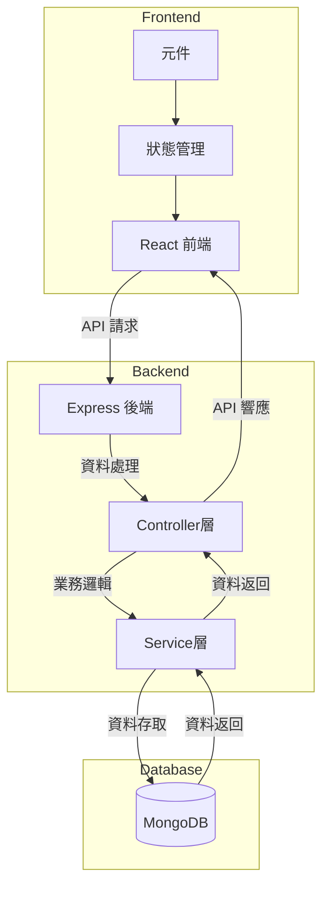
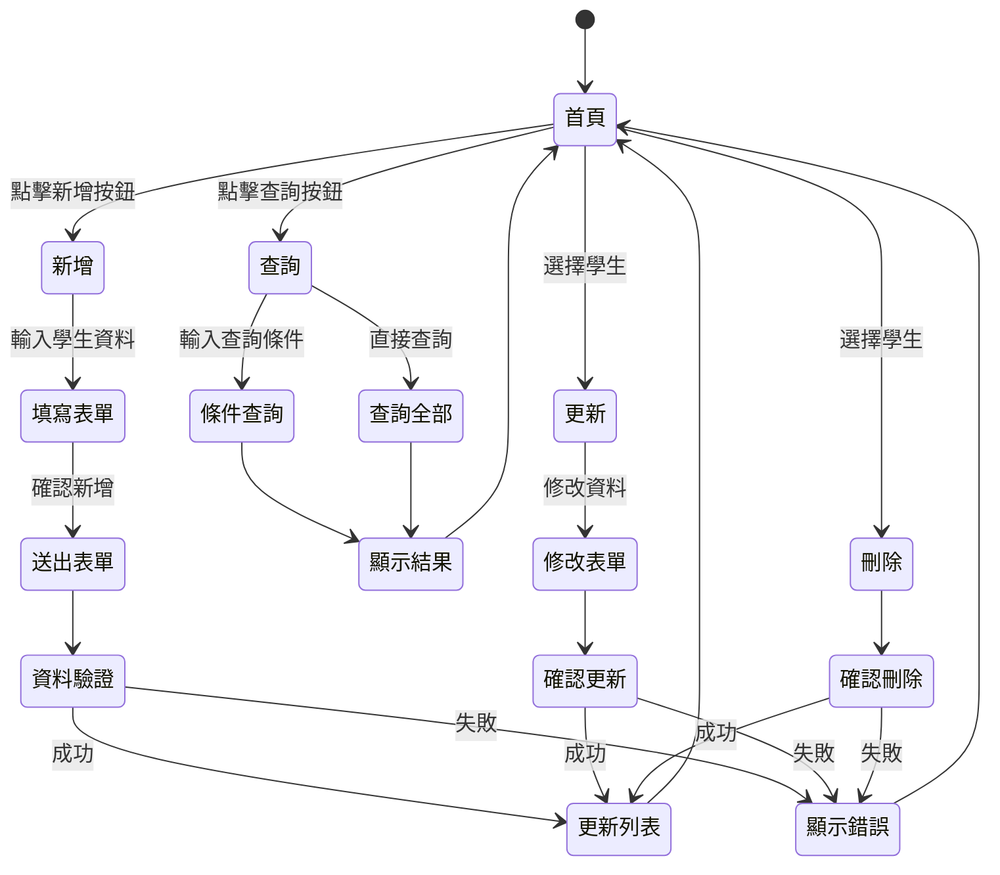

# 學生資料管理系統

這是一個基於 React 和 MongoDB 的學生資料管理系統，實現完整的 CRUD（Create, Read, Update, Delete）基本功能。
Demo影片: https://youtu.be/rRrQQLgGT0I

## 功能特點

- 新增學生資料
- 查詢全部學生資料
- 條件查詢（支援多個欄位）
- 更新學生資料
- 刪除學生資料
- 自動生成座號功能
- 錯誤提示與驗證

## 系統架構



## CRUD 操作流程



## 專案結構

```
project/
│
├── src/
│   ├── components/          # React 元件
│   ├── utils/              # 工具函數
│   │   ├── fetch.ts        # API 請求處理
│   │   └── MongoDB.ts      # 資料庫連接
│   │
│   ├── interface/          # TypeScript 介面定義
│   │   ├── Student.ts      # 學生資料介面
│   │   └── resp.ts         # API 響應介面
│   │
│   ├── enum/               # 列舉定義
│   │   └── api.ts          # API 端點定義
│   │
│   └── style/              # 樣式檔案
│       └── App.css         # 主要樣式
│
└── server/
    ├── controller/         # 控制器
    ├── service/           # 服務層
    ├── models/            # 資料模型
    └── routes/            # 路由定義
```

## 安裝與執行指引

### 前端部分

1. 安裝依賴套件
```bash
cd frontend
npm install
```

2. 設定環境變數
```bash
# 在前端目錄創建 .env 檔案
VITE_API_BASE_URL=http://localhost:5000/api/v1
```

3. 啟動開發伺服器
```bash
npm run dev
```

### 後端部分

1. 安裝依賴套件
```bash
cd backend
npm install
```

2. 設定環境變數
```bash
# 在後端目複製.env 檔案
PORT=5000
DBUSER=your_username
DBPASSWORD=your_password
DBHOST=your_host
DBPORT=your_port
DBNAME=your_database
```

3. 啟動伺服器
```bash
npm start
```

## API 規格說明

### 1. 獲取所有學生資料
- **請求方式**: GET
- **路徑**: `/api/v1/user/findAll`
- **回應格式**:
```typescript
{
  code: number,      // 200 表示成功
  message: string,   // 回應訊息
  body: Array
}
```

### 2. 新增學生
- **請求方式**: POST
- **路徑**: `/api/v1/user/insertOne`
- **請求格式**:
```typescript
{
  帳號: string,
  姓名: string,
  院系: string,
  年級: string,
  班級: string,
  Email: string
}
```
- **回應格式**:
```typescript
{
  code: number,      // 200 表示成功
  message: string,   // 回應訊息
  body: {
    _id: string,
    帳號: string,
    座號: number,    // 自動生成
    姓名: string,
    院系: string,
    年級: string,
    班級: string,
    Email: string
  }
}
```

### 3. 更新學生資料
- **請求方式**: PUT
- **路徑**: `/api/v1/user/:id`
- **請求格式**:
```typescript
{
  帳號?: string,
  姓名?: string,
  院系?: string,
  年級?: string,
  班級?: string,
  Email?: string
}
```
- **回應格式**:
```typescript
{
  code: number,      // 200 表示成功
  message: string,   // 回應訊息
  body: {
    _id: string,
    帳號: string,
    座號: number,
    姓名: string,
    院系: string,
    年級: string,
    班級: string,
    Email: string
  }
}
```

### 4. 刪除學生
- **請求方式**: DELETE
- **路徑**: `/api/v1/user/:id`
- **回應格式**:
```typescript
{
  code: number,      // 200 表示成功
  message: string,   // 回應訊息
  body: {
    _id: string,
    帳號: string,
    座號: number,
    姓名: string,
    院系: string,
    年級: string,
    班級: string,
    Email: string
  }
}
```

### 5. 條件查詢
- **請求方式**: GET
- **路徑**: `/api/v1/user/:field/:value`
- **參數說明**:
  - field: 查詢欄位（可為 帳號、座號、姓名、院系、年級、班級、Email）
  - value: 查詢值
- **回應格式**:
```typescript
{
  code: number,      // 200 表示成功，404 表示查無資料
  message: string,   // 回應訊息
  body: Array
}
```

### 錯誤回應
所有 API 在發生錯誤時都會返回統一格式：
```typescript
{
  code: number,      // 非 200 的狀態碼
  message: string,   // 錯誤訊息
  body: null
}
```

常見狀態碼：
- 200: 成功
- 400: 請求格式錯誤
- 404: 資源不存在
- 500: 伺服器錯誤

## 技術棧

- Frontend:
  - React
  - TypeScript
  - Vite
  - CSS

- Backend:
  - Express.js
  - MongoDB
  - Node.js

## 注意事項

- 座號為自動生成，不需手動輸入
- 更新和刪除操作需要先選擇學生資料
- 查詢功能支援多個欄位的條件搜尋